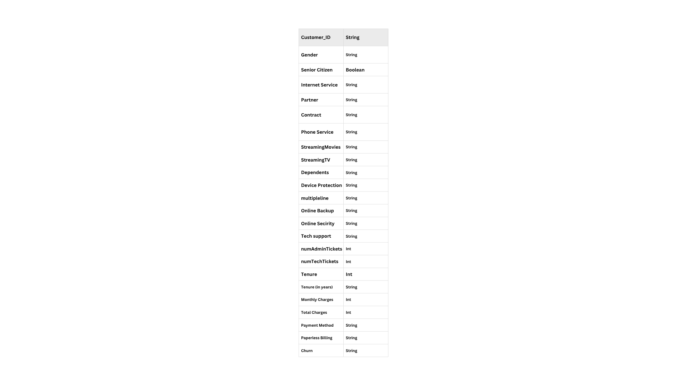
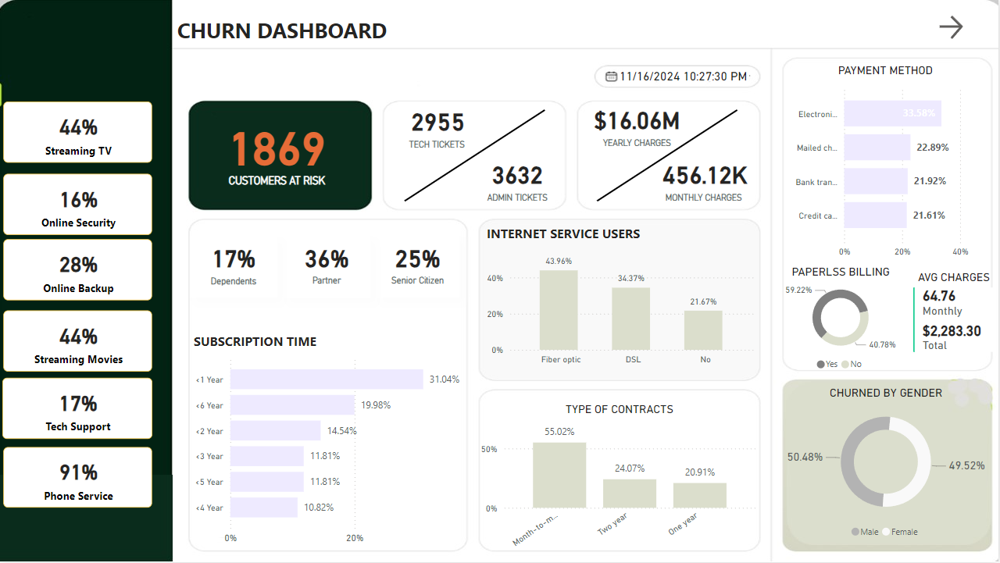
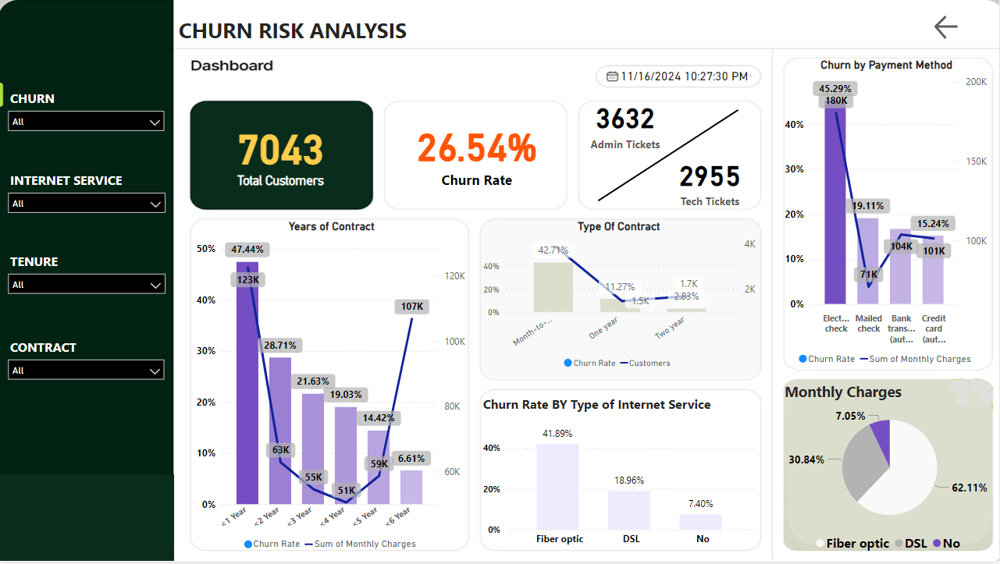

# Customer Churn Dashboard

## Table of Contents
- [Overview](#Overview)
- [Objective](#Objective)
- [Data Structure Overview](#[Data-Structure-Overview)
- [Executive Summary](#Executive-Summary)
- [Dashboard](#Dashboard)
- [Recommendation](#Recommendation)
- [Future Enhancements](#Future-Enhancements)
- [Contact](#contact)

## Overview

This project presents a comprehensive, data-driven Power BI dashboard designed to help telecom businesses understand, monitor, and reduce customer churn.

The dashboard leverages historical customer data to uncover key churn drivers, track churn trends across various segments, and provide decision-makers with real-time insights to design targeted retention strategies.

In highly competitive telecom markets, retaining existing customers is often more cost-effective than acquiring new ones. By transforming raw customer data into actionable business insights, this dashboard empowers business teams to make data-informed decisions that directly impact revenue and customer lifetime value (CLV).

## Objective

The primary objective of this project is to:
- Diagnose Churn Patterns:
Identify which customer segments are most at risk of leaving — segmented by contract type, tenure, payment method, internet service type, and geography.

- Highlight Key Drivers of Churn:
Use visual analytics to understand which variables (e.g., month-to-month contracts, fiber internet, high monthly charges) are strongly associated with churn, enabling business users to take targeted action.

- Enable Proactive Retention Strategies:
Allow business users (e.g., marketing or customer success teams) to explore high-churn customer profiles and simulate the impact of loyalty programs or long-term contracts on reducing churn risk.

- Monitor Performance & KPIs:
Provide executives with a centralized dashboard to monitor key metrics like overall churn rate, churn by demographics, and churn by product line in real time.

- Drive Revenue Protection:
By identifying the top 10% high-risk customers and allowing teams to intervene early, this dashboard supports revenue preservation and improves CLV by enhancing customer satisfaction and retention.

## Data Structure Overview

## Executive Summary

This project analyzes telecom customer data to identify key drivers of churn and inform retention strategies. With a churn rate of 27% (1,869 out of 7,043 customers), the analysis highlights several actionable insights:

 - Month-to-month contracts, high monthly charges, and lack of value-added services (like tech support or security) significantly increase churn risk.

 - Customers without dependents or partners are more likely to churn, while senior citizens show stronger retention.

 - Fiber optic users and those paying via electronic check show elevated churn rates, suggesting service or billing dissatisfaction.

 - Gender has minimal impact, confirming that behavior and service experience drive churn more than demographics.

These findings enable targeted retention efforts such as personalized offers, contract upgrades, and service bundling, helping telecom businesses reduce churn and improve customer lifetime value.

## Dashboard

### 1. **Customer Churn Dashboard**
This Power BI dashboard was designed to help telecom companies analyze and understand past customer churn in order to uncover key trends, behaviors, and revenue risks.

🔍 Why It Was Built:
To identify which customer groups are most likely to churn, understand the services they used, and quantify the financial impact — enabling business leaders to learn from past churn behavior and formulate smarter retention strategies.

🔧 Key Functionalities:
- Demographic Breakdown
Visualized churn distribution by age group, gender, senior citizen status, partner and dependent flags to help identify vulnerable customer segments. This insight supports the creation of personalized campaigns for at-risk profiles.

- Service Usage Patterns
Analyzed which combinations of services (e.g., internet, phone, streaming, online security) were most common among churned customers — guiding service improvement or bundling strategies to boost perceived value.

- Financial Impact Metrics
Calculated KPIs such as total churned revenue, average monthly charges, and contract type mix to show the monetary cost of churn and prioritize action based on value loss.

- Interactive Filters and Drill-through
Enabled dynamic exploration by geography, service type, contract length, and payment method — allowing different business teams (e.g., marketing, operations, finance) to extract insights relevant to their goals.

  

### 2. **Churn Risk Analysis Dashboard**
This forward-looking dashboard was built to predict which current customers are likely to churn and support proactive retention strategies based on risk segmentation.

 Why It Was Built:
To shift the organization from reactive to proactive churn management, giving decision-makers the ability to identify high-risk customers early and design data-backed interventions before they leave.

 Key Functionalities:
- Customer Risk Segmentation
Used Power BI DAX logic to classify current customers into Low, Medium, and High churn risk tiers based on behavioral attributes like tenure, payment method, support access, and contract type. This enables targeted outreach and prioritization.

- Churn Driver Visuals
Surfaced key churn predictors such as month-to-month contracts, fiber optic users, missing services, and high monthly charges, helping business teams focus on fixing churn root causes.

- Retention Strategy Insights
Embedded data-driven suggestions for each risk group, such as offering loyalty discounts to short-tenure users or bundling services for those lacking support features.

- Actionable Prioritization Tools
Designed user-friendly matrices and charts that allow customer success and marketing teams to easily filter and prioritize high-value, high-risk customers for intervention.

  
  
**Project** : - [Customer-Churn-Dashboard](assets/Projects/Customer-Churn-Dashboard.pbix)

## Recommendation

1.  Targeted Offers for Younger Customers
Recommendation:
Launch youth-centric deals or lifestyle bundles (e.g., affordable mobile + streaming combos, student discounts, or gaming add-ons) to appeal to younger demographics, who showed higher churn rates.

Why It Matters:
Younger customers are often more price-sensitive and have less brand loyalty. Creating tailored packages improves retention by increasing perceived value and emotional connection.
 Business Impact: Increases retention in a high-risk segment, builds early brand loyalty, and boosts future revenue through long-term engagement.

2.  Incentivize Long-Term Contracts
Recommendation:
Offer discounts, loyalty points, or exclusive benefits to customers who switch from month-to-month contracts to annual or biannual plans.

Why It Matters:
The data shows that month-to-month customers are significantly more likely to churn. Locking in customers to longer contracts ensures revenue stability and reduces churn volatility.
 Business Impact: Increases customer lifetime value (CLV), reduces acquisition costs, and helps forecast revenue more accurately.

3.  Introduce Flexible and Value-Based Pricing Plans
Recommendation:
Design new plan tiers that offer customizable services at lower cost — such as essential-only bundles or pay-as-you-go models — to attract price-sensitive customers.

Why It Matters:
High monthly charges are strongly linked to churn. Offering flexible plans increases affordability while maintaining core service value.
 Business Impact: Reduces churn due to cost dissatisfaction, captures broader market share, and builds goodwill in budget-conscious segments.

4.  Create a Tiered Loyalty Program
Recommendation:
Implement a customer loyalty program that rewards tenure with free add-ons, exclusive discounts, or early access to new features.

Why It Matters:
Customers with longer tenure are more likely to stay if they feel valued. Loyalty programs also gamify the experience and provide emotional incentives to continue.
 Business Impact: Enhances customer engagement, drives upselling opportunities, and transforms passive users into brand advocates.

5.  Simplify Payments & Reward Auto-Pay Setup
Recommendation:
Streamline the electronic check process and offer small incentives (e.g., cashback or billing credits) for setting up auto-pay with low-friction methods.

Why It Matters:
Electronic check users have the highest churn rate, likely due to inconvenience or payment failures. Improving ease-of-use and rewarding auto-pay boosts reliability and satisfaction.
 Business Impact: Improves payment collection efficiency, reduces involuntary churn due to billing issues, and enhances customer satisfaction through smoother experiences.

## Future Enhancements
- **Predictive Modeling**: Integrate machine learning models to predict churn probability and automate churn prevention strategies.
- **Advanced Segmentation**: Refine customer segments using more granular features for greater precision in risk analysis.
- **Incorporate Real-Time Data**: Enhance the dashboards with real-time data feeds for dynamic churn analysis.

## Contact
- **Sahil Patra**
- [+91 7735367833]
- [sahilpatra1004@gmail.com]
- [[LinkedIn Profile](https://www.linkedin.com/in/sahil-patra10)]

---

